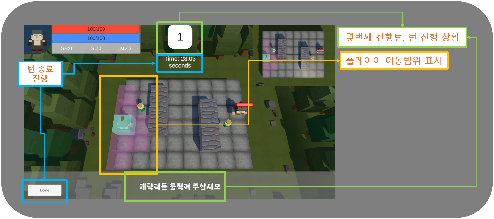
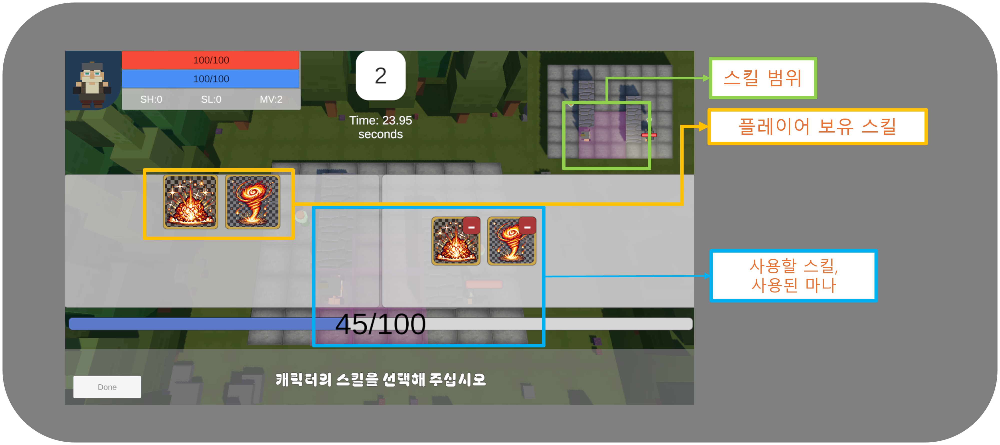

# tower of valor (개발중)
___

## 개요
 - 해당 게임은 스테이지 형식의 턴제 기반 게임입니다. 

## 사용기술, tool
- unity, C#

---

## 게임 주요 구현

### 턴 시스템
 - 모든 턴은 이벤트로 설계
   - 게임시작 -> 이동 -> 이동종료 -> 스킬선택 -> 스킬플레이 -> 이동부터 반복
   - 이와 같은 설계를 선택한 이유는 상태변화로 게임을 업데이트 하는것 보다. 좀더 유연하고 이벤트 구독을 변경할수 있는 구조와 유지보수가 쉽도록 구성했습니다.

### 적 ai설정
 - 좌표 평면에서 플레이어의 위치까지 제일 가까운 경로를 찾기 위해 a* 알고리즘을 사용했습니다. ([코드 링크](https://github.com/qornwh/TurnBaseGame/blob/58fd5106fbeff231a1249fd9fd07f799d4b9fa3f/Assets/Scripts/Player/PlayerController.cs#L96)
 - 공격 알고리즘
   1. 플레이어가 공격 범위에 있는지 판단
   2. 우선순위 큐로 mp를 사용가능한 가장 공격력이 높은 스킬부터 사용

### ui
 - PlayerUi : 현재 플레이어의 능력치 상태 확인창(playerState가 변경될 때 마다 업데이트 호출 : [코드 링크](https://github.com/qornwh/TurnBaseGame/blob/58fd5106fbeff231a1249fd9fd07f799d4b9fa3f/Assets/Scripts/Player/StateBase.cs#L48)
 - DoneUi : 플레이어의 이동, 스킬 선택 종료 이벤트 창

 - 스킬 범위는 우상단 미니맵 확인가능

### 설정 파일
 - 플레이어, 스킬, 맵, 타일에 대한 데이터및 초기값 셋팅 정보
 - 스킬의 경우 스킬레벨에 따라 처리

### 모듈 구현
 - 게임 구현에 사용되는 utills 모듈 구현
 - a*알고리즘에서 사용되는 **우선순위 큐** 구현 : [코드링크](https://github.com/qornwh/TurnBaseGame/blob/58fd5106fbeff231a1249fd9fd07f799d4b9fa3f/Assets/Scripts/Utills/PriorityQueue.cs#L7)

---

향후 계획
1. 각종 다른 스테이지 구현
2. 게임 저장데이터 구현
3. 스킬 우선순위 조정(버프, 회복, 공격)
4. 유니티 테스트러너에 우선순위 큐, 설정 읽기 테스트 구현